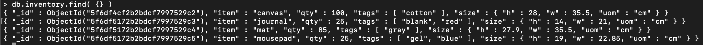
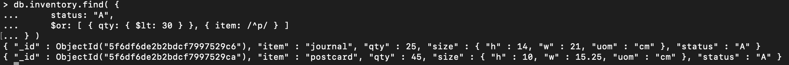
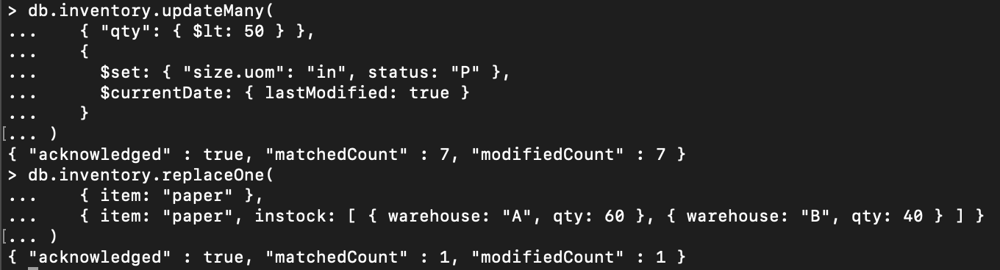
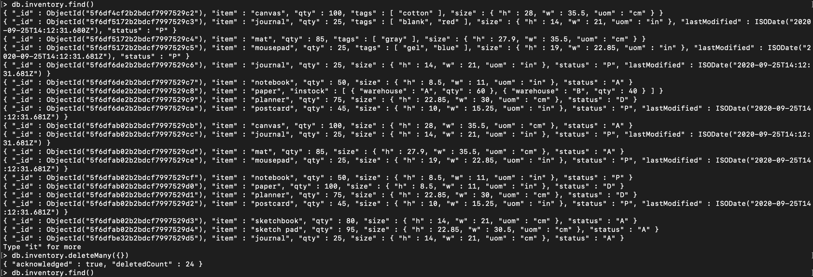
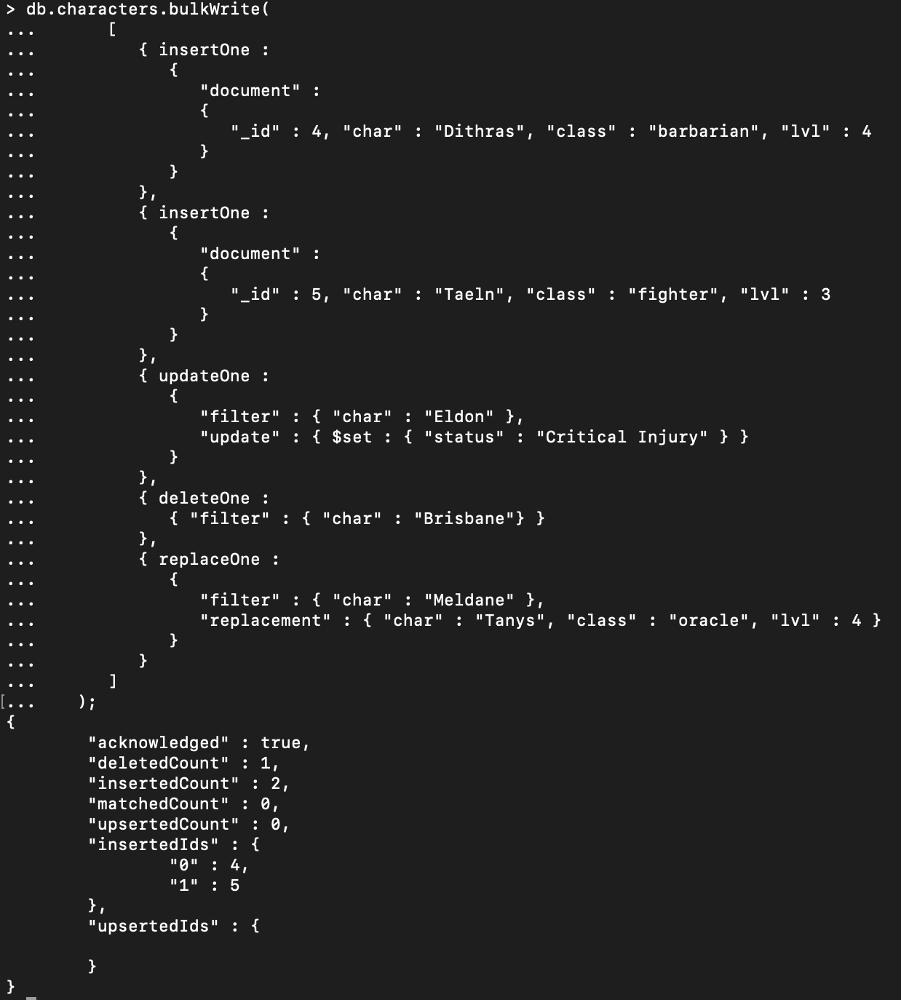
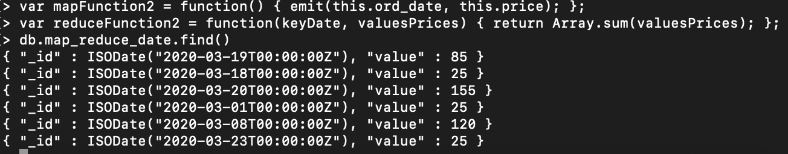

# DAT250: Software Technology Experiment Assignment 3

* Installation
    * No problems
    * Homebrew used for installation, no screenshot

* Experiment 1: MongoDB CRUD operations
    * Insert documents
        * Finding the 4 documents inserted
        
    * Query documents
        * Last query
        
    * Update documents
        * Update multiple and replace
        
    * Remove documents
        * Deleted all documents
        
    * Bulk write
        * Bulk write and print result
        
        
* Experiment 2: Aggregation
    * Working example
    
    * Map_reduce to find total price for each date. Might be useful to create historical data.
    
    
* Issues
    * No pending issues